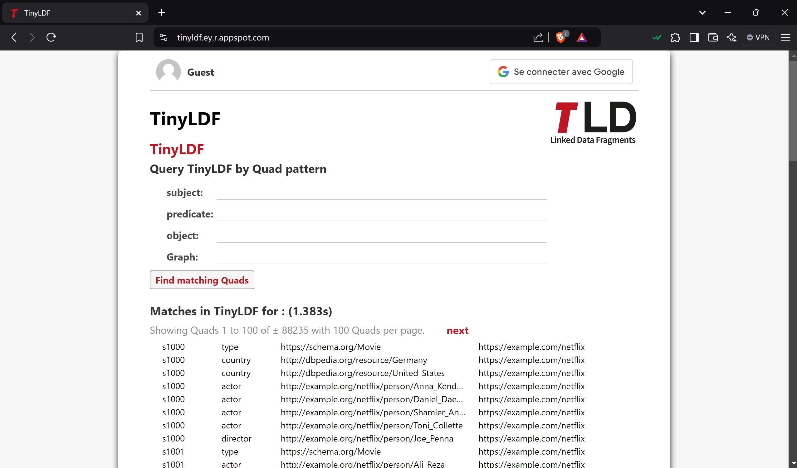
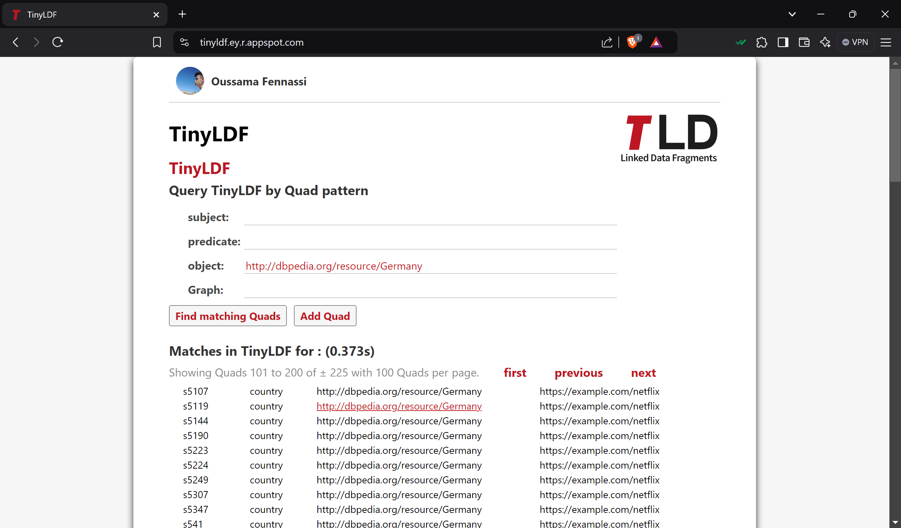

# TinyLDF: A Lightweight Linked Data Platform

TinyLDF is a lightweight Linked Data Fragments platform that allows users to perform SPARQL-like quad searches and add new quads, provided they are authenticated. The platform supports Google Authentication and features a responsive web app built with Mithril.js, CSS, Java (REST API), and Google Cloud Datastore.

---

## Features

### Core Functionalities
1. **Quad Search**
   - Search using `subject`, `predicate`, `object`, and `graph`.
   - Results are displayed in a structured table where:
     - Columns represent `subject`, `object`, `predicate`, and `graph`.
     - Clicking on any table cell filters results based on the clicked value.

2. **Add New Quads**
   - Authenticated users can add new quads (`subject`, `predicate`, `object`, `graph`) to the datastore.

3. **Performance Insights**
 
   The Performance Insights page provides valuable metrics for analyzing the efficiency of API queries. Access it here:

   **[Performance Insights Page](https://tinyldf.ey.r.appspot.com/performance.html)**

   #### **Key Features**
   - **Execution Time Monitoring**:  
   Each API call displays the execution time for retrieving results, allowing users to track performance transparently.

   - **Standard Deviation Reporting**:  
   The system calculates the **average execution time** and the **standard deviation** for query response times:
   - **Average (Mean)**: Provides the overall performance metric.
   - **Standard Deviation**: Indicates the consistency and variability in execution times.

   - **Detailed Query Results**:  
   A list of query execution times is displayed, showing:
   - Query Index (e.g., Query 1, Query 2).
   - Execution time in milliseconds (or `"Failed"` if the query was unsuccessful).

   - **Run Performance Tests**:
   A button labeled `Run Performance Test` allows users to execute a predefined set of API queries to gather live performance data.

   #### **How It Works**
   1. A series of predefined queries are sent to the API, covering various parameters and use cases.
   2. Each query’s execution time is recorded, and the results are displayed in a detailed list.

---

## Technologies Used

- **Frontend**: 
  - [Mithril.js](https://mithril.js.org/) for a lightweight and fast UI framework.
  - CSS for styling.

- **Backend**: 
  - Java-based REST API for processing quad searches and additions.
  - Google Cloud Datastore for data storage.

- **Authentication**:
  - Google Authentication for secure access to quad creation features.

---

## Screens

### Screen 1: Home Page (Before Authentication)

### Screen 2: Home Page (After Authentication)

